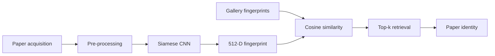

<div align="center">

# BLIND

### Paper Sheet Authentication through Intrinsic Visual Fingerprints

**A deep learning framework for identifying and authenticating individual paper sheets using Siamese Networks and intrinsic paper texture.**

<br>


</div>

---

## Overview

**BLIND** is a framework for authenticating individual paper sheets from their intrinsic visual characteristics.

The underlying idea is that the microscopic texture and structure of paper introduce distinctive visual patterns that can be used as a **physical fingerprint**. Rather than recognizing the printed content of a document, BLIND aims to identify the **physical sheet itself**.

A **Siamese Convolutional Neural Network** is trained using contrastive learning to map different acquisitions of the same paper sheet close together in the embedding space, while separating acquisitions belonging to different sheets.

At inference time, authentication is performed through **cosine similarity** between the query fingerprint and a gallery of previously enrolled fingerprints.

---

## Method



The authentication pipeline consists of four main stages:

1. **Paper acquisition** — an image of the physical paper surface is captured.
2. **Fingerprint extraction** — the Siamese CNN maps the acquisition to a compact deep embedding.
3. **Fingerprint comparison** — the query embedding is compared against the enrolled gallery using cosine similarity.
4. **Retrieval** — the most similar paper identities are returned according to Top-\(k\) ranking.

---

## Siamese Network

The proposed model uses a Siamese CNN trained with **contrastive loss**.

Two paper acquisitions are processed by identical network branches sharing the same parameters.

- **Positive pairs** contain acquisitions of the same physical sheet.
- **Negative pairs** contain acquisitions belonging to different sheets.

The network learns an embedding space in which:

```text
same paper      → small embedding distance
different paper → large embedding distance
```

The resulting **512-dimensional embedding** represents the deep fingerprint of the paper sheet.

During evaluation, fingerprints are compared using **cosine similarity**.

---

## Dataset

The BLIND dataset is distributed as a compressed archive:

```text
dataset/

```

> **Note:** the dataset archive is a large file and is tracked using Git LFS.

The dataset contains multiple acquisitions of physical paper sheets together with different robustness conditions designed to evaluate authentication under realistic changes.

| Condition | Description |
|---|---|
| **Original** | Reference acquisition used for enrollment |
| **Reacquisition** | Independent acquisitions of the same physical sheet |
| **Stain** | Paper surface affected by increasing levels of staining |
| **Tear** | Paper affected by increasing levels of physical tearing |
| **Brightness** | Acquisitions evaluated under different brightness levels |

These conditions make it possible to evaluate whether the extracted fingerprint remains discriminative even when the physical document or acquisition conditions change.

---

## Evaluation Protocol

Authentication is formulated as an **image retrieval problem**.

Given a query acquisition \(q\), its fingerprint is compared with every fingerprint in the gallery using cosine similarity:

$$
\[
S(q,g)=
\frac{e_q \cdot e_g}
{\|e_q\|_2 \|e_g\|_2}
\]
$$

where $e_q$ is the query embedding and \(e_g\) is a gallery embedding.

Gallery samples are ranked according to their similarity with the query.

Performance is evaluated using:

- **Top-1 Accuracy**
- **Top-3 Accuracy**
- **Top-5 Accuracy**
- **Top-10 Accuracy**

---

## Results

The method achieves high retrieval accuracy across multiple acquisition and degradation conditions.

| Evaluation condition | Top-1 Accuracy |
|---|---:|
| Reacquisition | **98.95%** |
| Stain | **98.50%** |
| Tear | **98.92%** |

For Top-3 and higher retrieval ranks, performance approaches or exceeds **99%** across the